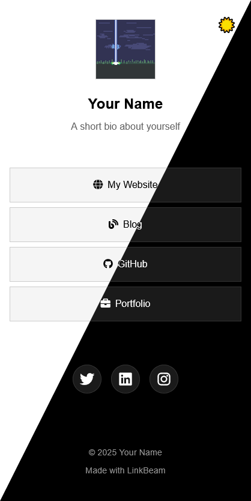

# LinkBeam


A lightweight static site generator for creating beautiful personal link-in-bio pages.
Built with Go, LinkBeam transforms a simple YAML configuration into a themed HTML page.

## Features

- Simple YAML-based configuration - Define your links and profile in a single YAML file
- Multiple built-in themes - Auto, Nord, Gruvbox, and Catppuccin variants (Latte, Frappé, Macchiato, Mocha)
- Theme switcher - Users can toggle between system/light/dark modes
- Font Awesome icons - Full support for Font Awesome icons with customizable CDN
- Social media links - Dedicated section for social profiles with icon-only display
- Responsive design - Works beautifully on mobile, tablet, and desktop
- Fast static site generation - Built with Go for blazing-fast builds
- Clean, minimal aesthetics - Focus on your content, not clutter
- [Catppuccin](https://catppuccin.com/), [gruvbox](https://github.com/morhetz/gruvbox) and [nord](https://www.nordtheme.com/) color palletes available by default

## Installation

### From Source

```bash
# Clone the repository
git clone https://github.com/5mdt/linkbeam.git
cd linkbeam

# Build the binary
make build
```

Binary will be output to `dist/linkbeam`.

### From Docker

```bash
# Build the image locally (Docker images not published yet)
docker build -t linkbeam .

# Run with your config
docker run -v $(pwd)/config.yaml:/app/config/config.yaml \
           -v $(pwd)/dist:/app/dist \
           linkbeam

# Or using docker-compose
docker-compose up
```

## Quick Start

1. Create a `config.yaml` file (see `config.example.yaml` for reference):

```yaml
name: "Your Name"
bio: "A short bio about yourself"
avatar: "static/logo.png"  # Can be a local path or URL
theme: "auto"  # Options: auto, nord, gruvbox, catppuccin-mocha, catppuccin-latte, etc.

# Optional: Customize Font Awesome CDN (defaults to Font Awesome 6.5.1 if not specified)
# font_awesome_cdn: "https://cdnjs.cloudflare.com/ajax/libs/font-awesome/6.5.1/css/all.min.css"

links:
  - title: "My Website"
    url: "https://yourwebsite.com"
    icon: "fas fa-globe"
  - title: "Blog"
    url: "https://yourblog.com"
    icon: "fas fa-blog"
  - title: "GitHub"
    url: "https://github.com/yourusername"
    icon: "fab fa-github"

socials:
  - platform: "Twitter"
    url: "https://twitter.com/yourusername"
    icon: "fab fa-twitter"
  - platform: "LinkedIn"
    url: "https://linkedin.com/in/yourusername"
    icon: "fab fa-linkedin"
  - platform: "Instagram"
    url: "https://instagram.com/yourusername"
    icon: "fab fa-instagram"

footer:
  - text: "© 2025 Your Name"
  - text: "Made with LinkBeam"
```

2. Generate your site:

```bash
./linkbeam
```

3. Open `dist/index.html` in your browser

## Usage

```bash
./linkbeam [options]

Options:
  -c, --config string     path to config YAML file (default "config.yaml")
  -t, --template string   path to HTML template (default "templates/base.html")
  -o, --output string     path to output HTML file (default "dist/index.html")
  -v, --version           print version information
```

### Examples

```bash
# Generate with default config.yaml
./linkbeam

# Check version
./linkbeam -v

# Generate with custom config
./linkbeam -c myconfig.yaml -o public/index.html
```

## Configuration

### Required Fields

- `name`: Your display name (cannot be empty)

### Optional Fields

- `bio`: A short description about yourself
- `avatar`: Path to your avatar/profile image (local path or URL starting with `http://` or `https://`)
- `theme`: Theme name (default: `auto`)
  - Available themes: `auto`, `nord`, `gruvbox`, `catppuccin-mocha`, `catppuccin-latte`, `catppuccin-frappe`, `catppuccin-macchiato`
  - The `auto` theme follows system preferences and allows users to toggle between system/light/dark modes
- `font_awesome_cdn`: Custom Font Awesome CDN URL (defaults to Font Awesome 6.5.1 if not specified)
- `links`: Array of link objects
  - `title`: Link text (required)
  - `url`: Link destination (required)
  - `icon`: Font Awesome icon class (optional, e.g., `fas fa-globe`, `fab fa-github`)
- `socials`: Array of social media links (displayed as icon-only buttons)
  - `platform`: Platform name (used for accessibility)
  - `url`: Social media profile URL
  - `icon`: Font Awesome icon class (e.g., `fab fa-twitter`, `fab fa-linkedin`)
- `footer`: Array of footer text blocks
  - `text`: Footer text content

### Theme Details

All themes support light/dark mode switching:
- **auto**: Minimalist monochrome theme with system preference detection
- **nord**: Arctic-inspired color palette (Nord theme)
- **gruvbox**: Warm retro groove colors (Gruvbox theme)
- **catppuccin-***: Soothing pastel themes (Catppuccin Latte, Frappé, Macchiato, Mocha)

## Contributing

See [CONTRIBUTING.md](CONTRIBUTING.md) for development setup, testing, and contribution guidelines.

## License

This project is licensed under the GNU General Public License v3.0 - see the [LICENSE](LICENSE) file for details.
